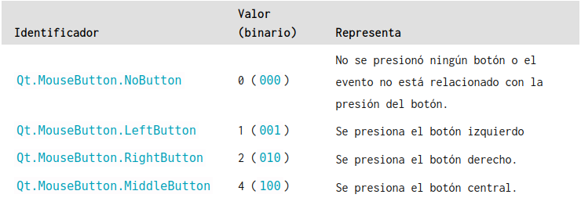

# Eventos
1. Interacion del usuario con una
aplicación Qt = genera un **evento**. 
2. Qt empaqueta la info del evento en 
**objetos de evento**.
3. Los objetos de evento
se pasan a **controladores de eventos**.
   
## 1. Controladores de eventos
* Se definen como cualquier otro método.
* Nombre es específico para el tipo de evento que manejan.
* Pueden ser:
  * Personalizados
  * Extendidos
```python
miBoton = QPushButton("Press me!")
miBoton.doubleClicked.connect(self.double_click_event)

# Personalizado
def double_click_event(self):
    print("¡Doble clic detectado!")
    
# Extendido
def mousePressEvent(self, event):
  if event.button() == Qt.MouseButton.LeftButton:
    pass
  elif event.button() == Qt.MouseButton.RightButton:
    pass
        
```

### Ejemplo
Eventos de tipo: `QMouseEvent`
#### Controladores de eventos (algunos):
* `mouseMoveEvent`
* `mousePressEvent`
* `mouseReleaseEvent` Boton del ratón liberado
* `mouseDobleClickEvent`

> Metodos especificos
> de eventos que pertenecen a clases que heredan de 
> `QWidget`, como `QMainWindow`, `QPushButton`, `QLabel`...

#### Proceso
1. Hago un click en un widget.
2. Se envía el evento: `QMouseEvent` al *controlador
de eventos*.
3. Este controlador (`mousePressEvent`) puede usar el 
*objeto del evento* para encontrar información
sobre lo sucedido.
4. Manejamos la información del objeto. Filtramos, 
clasificamos, podemos usar `super()`...

## 2. Objetos de eventos
### Ejemplo
Eventos de tipo `QMouseEvent`
#### Metodos del objeto de evento disponibles (algunos)
Estos metodos se llaman para extraer infor sobre el evento 
en cuestión.
* `.button()` Boton especifico que desencadenó el evento.
* `.buttons()` Estado de todos los botones del mouse.
* `.position()` Posición relativa del widget como un 
`QPoint` (numero entero).

> `QMouseEvent` es la clase que contiene info sobre un 
> evento del ratón específico.

*Conclusión*. Método estilo `mouseMoveEvent` son métodos 
de manejo de eventos en los *widgets*, mientras que los 
métodos estilo `.button()` son métodos para obtener 
información sobre un evento del ratón específico.

## 3. Informacion



