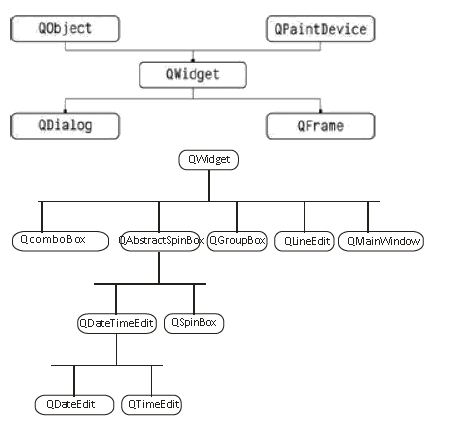
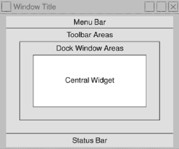

# Primeros pasos PyQt6
`QApplication` maneja la configuracion princial
y contienen el bucle de eventos principal.

`QWidget` es la clase base para todos los 
objetos de le IU

Cada widget de PyQt que deriva de `QObject`
esta diseñado para emitir `signal` en respuesta
a uno o más eventos. La señal por si sola no realiza
ninguna acción pero esta conectada a un `slot`.

Esta ranura (`slot`) puede ser cualquier funcion
de Python que se pueda llamar. Mas [info](../eventos/README.md).

El instalador de PyQt viene con **Qt Designer**
que es una herramienta de diseño para contruir
la GUI de manera gráfica, arrastrando y soltando
los widgets.

## Bucle de eventos
El nucleo de las app Qt es la clase `QtApplication`.
* Cada app necesita 1 y solo uno para funcionar.
* La instancia contiene el bucle de eventos de su app.

### Funcionamiento
1. Cada interaccion con la app genera un **evento**
que se coloca en la **cola de eventos**.
2. El bucle de eventos verifica en cada interaccion
si se encuentra un evento en espera.
3. Si hay un evento en espera se pasa al 
**controlador de eventos** específico para ese evento.
4. El controlador de eventos se ocupa de dicho evento
y devuelve el control al bucle de eventos.

## Buena practica
En Qt cualquier widget puede ser ventana.
Pero esto no es practico por eso usamos `QMainWindow`
el cual es un widget especialmente diseñado para esto
y tiene muchas funciones estandar que utilizara en sus 
aplicaciones. Algunas de estas herramientas se peden 
ver en la imagen de abajo: barras de herramientas,
 menus, barra de estado, widgets acoplables...

`QMainWindow` ventana de nivel superior de la GUI.
Algunos widgets ocupan un lugar designado por
esta ventana principal y otros se colocan en el
area central de widgets utilizando varios
administradores de diseño (se refiere al los
layout?¿)

